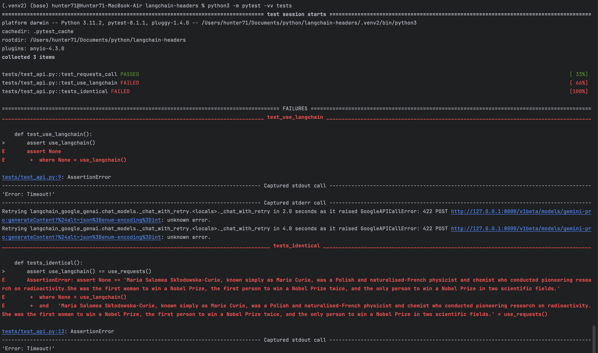
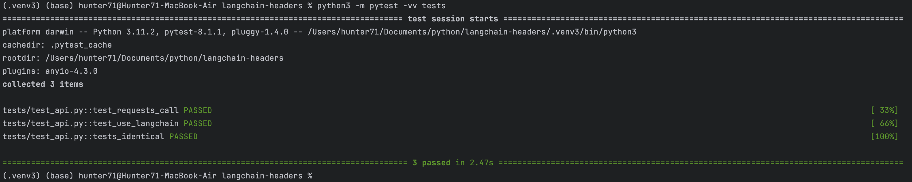

# Langchain headers

This is very simple library that experimentally shows problem of passing additional headers through langchain models.
Within this repo there is also tested the potential solution to mitigate the problem.

## Testing current implementation

### Testing with Docker

```shell
$ docker compose up -d app
$ docker compose run tests
```

### Testing locally

```shell
$ python -m venv .venv
$ source .venv/bin/activate
$ pip install -r requirements.txt
$ python3 -m pytest -vv tests
```

### Results of testing current implementation

Langchain tests will fail, as the endpoint requires additional headers,
that are not provided through `ChatGoogleGenerativeAI` class.



## Test potential solution

Potential solution is presented within https://github.com/Hunter71/langchain-google project
that is a fork of https://github.com/langchain-ai/langchain-google.

### Testing with Docker

```shell
$ docker compose up -d app-feat
$ docker compose run tests-feat
```

### Testing locally

```shell
$ python -m venv .venv-feat
$ source .venv-feat/bin/activate
$ pip install -r requirements-feat.txt
$ python3 -m pytest -vv tests
```

### Results of testing potential solution

Langchain tests will succeed, as the endpoint requires additional headers,
that are provided with proposed implementation of `ChatGoogleGenerativeAI` class.


